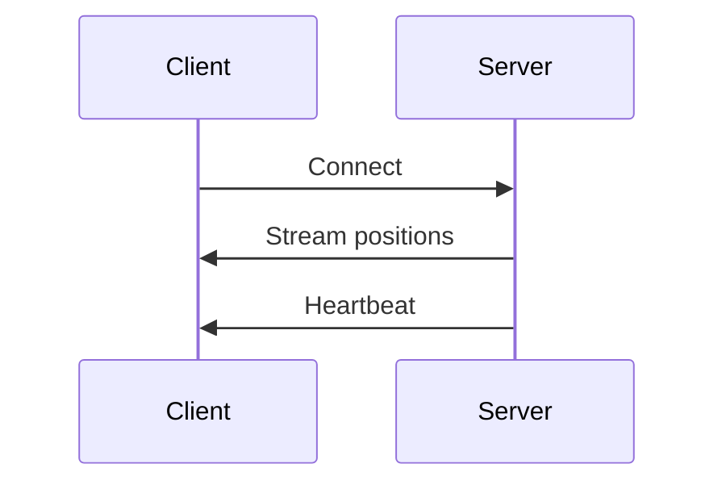

import Heading from "@theme/Heading";
import Tabs from "@theme/Tabs";
import TabItem from "@theme/TabItem";

# SSE with vehicle monitoring positions

The SSE endpoint provides a continuous stream of vehicle position updates for the entire Lyon TCL public transport network. This unidirectional connection automatically reconnects and delivers real-time position data without the need for polling.

## Endpoint

```
https://api.dotshell.eu/pelo/v1/vehicle-monitoring/positions/stream
```

## Connection Flow



## Connection

### Establishing Connection

```bash
curl -N https://api.dotshell.eu/pelo/v1/vehicle-monitoring/positions/stream
```

### Response Headers

```http
HTTP/1.1 200 OK
Content-Type: text/event-stream
Cache-Control: no-cache
Connection: keep-alive
X-Accel-Buffering: no
```

## Event Types

The stream emits two types of events:

### 1. Position Updates

**Event**: `positions`

Contains the complete vehicle monitoring payload with all active vehicles and their positions.

```
event: positions
data: {
  "count": 150,
  "lastUpdated": "2024-02-28T14:30:00.000Z",
  "payload": {
    "vehicles": [
      {
        "id": "vehicle_123",
        "line": "C1",
        "latitude": 45.764043,
        "longitude": 4.835659,
        "bearing": 90,
        "speed": 30,
        "timestamp": "2024-02-28T14:30:00.000Z",
        "vehicleType": "bus",
        "tripId": "trip_456",
        "nextStop": "Stop_A",
        "nextStopDistance": 500
      },
      // ... more vehicles
    ]
  }
}
```

### 2. Heartbeat

**Event**: `heartbeat`

Sent periodically to maintain the connection and verify client presence.

```
event: heartbeat
data: {}
```

## Event Frequency

- **Position updates**: Every 10-30 seconds (depending on data changes)
- **Heartbeat**: Every 20 seconds
- **Automatic reconnection**: If connection drops, browser automatically reconnects

## Connection Management

### Automatic Reconnection

SSE connections automatically reconnect when:
- Network interruptions occur
- Server restarts
- Brief connection losses happen

### Manual Disconnection

To close the connection:

```javascript
// JavaScript EventSource
eventSource.close();

// curl
// Press Ctrl+C
```

## Code Example (JavaScript)

```javascript
// Basic SSE connection
const eventSource = new EventSource('https://api.dotshell.eu/pelo/v1/vehicle-monitoring/positions/stream');

eventSource.onopen = () => {
  console.log('SSE connection opened');
};

eventSource.onmessage = (event) => {
  console.log('Raw message:', event.data);
};

eventSource.addEventListener('positions', (event) => {
  const data = JSON.parse(event.data);
  console.log('Position update:', data);

  // Process vehicles
  data.payload.vehicles.forEach(vehicle => {
    console.log(`Vehicle ${vehicle.id} (${vehicle.line}) at ` +
                `${vehicle.latitude}, ${vehicle.longitude}`);
  });
});

eventSource.addEventListener('heartbeat', () => {
  console.log('Heartbeat received - connection alive');
});

eventSource.onerror = (error) => {
  console.error('SSE error:', error);
  // Connection will automatically attempt to reconnect
};

// Close connection when needed
// eventSource.close();
```

## Best Practices

1. **Connection management**: Let the browser handle reconnection automatically
2. **Data processing**: Process updates efficiently to avoid UI lag
3. **State management**: Maintain vehicle state between updates
4. **Error handling**: Monitor connection status and inform users
5. **Memory management**: Clean up old vehicle data periodically
6. **Rate limiting**: Be prepared for frequent updates during peak hours
