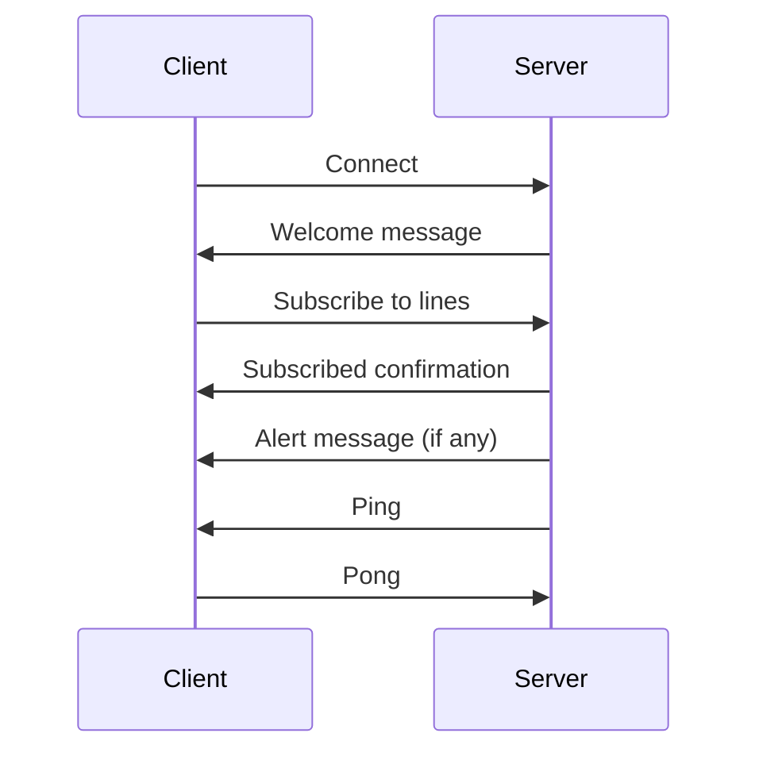

import Heading from "@theme/Heading";
import Tabs from "@theme/Tabs";
import TabItem from "@theme/TabItem";

# WS with traffic alerts

The WebSocket endpoint provides real-time traffic alerts for the Lyon TCL public transport network.

## Endpoint

```
wss://api.dotshell.eu/pelo/v1/traffic/alerts/ws
```

## Connection Flow



## Connection

### Establishing Connection

When you first connect, you'll receive a `welcome` message:

```json
{
  "type": "welcome",
  "maxFavorites": 50
}
```

### Heartbeat

The server sends periodic ping messages to maintain the connection. You should respond with pong:

**Server → Client**:
```json
{
  "type": "ping"
}
```

**Client → Server**:
```json
{
  "type": "pong"
}
```

## Subscription Management

### Subscribing to Lines

To receive alerts for specific lines, send a `subscribe` message:

```json
{
  "type": "subscribe",
  "lines": ["C1", "C3", "METRO_A"]
}
```

**Response**:
```json
{
  "type": "subscribed",
  "lines": ["C1", "C3", "METRO_A"],
  "maxFavorites": 50,
  "truncated": false
}
```

### Subscription Rules

- **Maximum lines**: 50 per connection
- **Line format**: String identifiers (e.g., "C1", "METRO_B")
- **Duplicates**: Automatically removed
- **Truncation**: If you send more than 50 lines, only the first 50 are subscribed

## Alert Messages

When a traffic alert occurs on a subscribed line, you'll receive:

```json
{
  "type": "alert",
  "line": "C1",
  "key": "alert_12345",
  "timestamp": "2024-02-28T14:30:00.000Z",
  "alert": {
    "id": "12345",
    "line": "C1",
    "title": "Traffic disruption",
    "description": "Delay due to road works",
    "severity": "medium",
    "startTime": "2024-02-28T14:30:00.000Z",
    "endTime": "2024-02-28T16:30:00.000Z",
    "affectedStops": ["Stop1", "Stop2"]
  }
}
```

## Error Handling

If you send an invalid message, you'll receive an error:

```json
{
  "type": "error",
  "error": "invalid_json" // or "invalid_message", "invalid_lines", "unknown_type"
}
```

### Error Types

- `invalid_json`: Malformed JSON
- `invalid_message`: Missing required fields
- `invalid_lines`: Lines field is not an array
- `unknown_type`: Unknown message type

## Code Example (JavaScript)

```javascript
const socket = new WebSocket('wss://api.dotshell.eu/pelo/v1/traffic/alerts/ws');

socket.onopen = () => {
  console.log('Connected to traffic alerts WebSocket');

  // Subscribe to lines
  socket.send(JSON.stringify({
    type: 'subscribe',
    lines: ['C1', 'C3', 'METRO_A']
  }));
};

socket.onmessage = (event) => {
  const message = JSON.parse(event.data);

  switch (message.type) {
    case 'welcome':
      console.log('Welcome:', message);
      break;
    case 'subscribed':
      console.log('Subscribed to lines:', message.lines);
      break;
    case 'alert':
      console.log('New alert for line', message.line, ':', message.alert);
      break;
    case 'ping':
      socket.send(JSON.stringify({ type: 'pong' }));
      break;
    case 'error':
      console.error('Error:', message.error);
      break;
  }
};

socket.onclose = () => {
  console.log('Connection closed, attempting to reconnect...');
  // Implement reconnection logic here
};

socket.onerror = (error) => {
  console.error('WebSocket error:', error);
};
```

## Best Practices

1. **Manage subscriptions**: Only subscribe to lines you actually need
2. **Handle reconnections**: Implement automatic reconnection with backoff
3. **Process alerts efficiently**: Handle alerts asynchronously to avoid blocking
4. **Monitor connection health**: Track ping/pong exchanges
5. **Clean up**: Close the connection properly when your application shuts down
6. **Rate limiting**: Don't exceed 50 lines per connection
