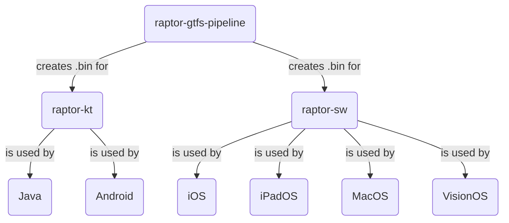

# Introduction to RAPTOR routing algorithm

**RAPTOR** means **R**ound-B**a**sed **P**ublic **T**ransit **O**ptimized **R**outing.

The RAPTOR routing algorithm has been theorized in [this](https://www.microsoft.com/en-us/research/wp-content/uploads/2012/01/raptor_alenex.pdf) research paper by *Microsoft* in January 2012.

Its goal is to find the best routes between two points in a public transport network. Unlike Djikstra-based algorithms,
RAPTOR directly uses the powerful structure of **GTFS**. It doesn't use vertex and edges but stops, routes and trips.

## A brief introduction to GTFS

**GTFS**, as [their website](https://gtfs.org) says means **G**eneral **T**ransit **F**eed **S**pecification and is 
"a community-driven open standard for rider-facing transit information". GTFS is stored as a ZIP archive of multiple
CSV files (with .txt extension). As precedently said, it contains multiple information like stops, routes, trips, hours...
It contains every timetable of every stop in the network.

## Our implementation

After this brief introduction to GTFS, here is our implementation of RAPTOR routing algorithm.

It consists in a python pipeline converting the GTFS of your choice into optimized for production, period-sorted
.bin files. Theses generated files are used by our libraries : **raptor-kt** for Kotlin and **raptor-sw** for swift.

Here is a diagram to help you understand more deeply.

---

---

Let's start by creating .bin files with **raptor-gtfs-pipeline**.